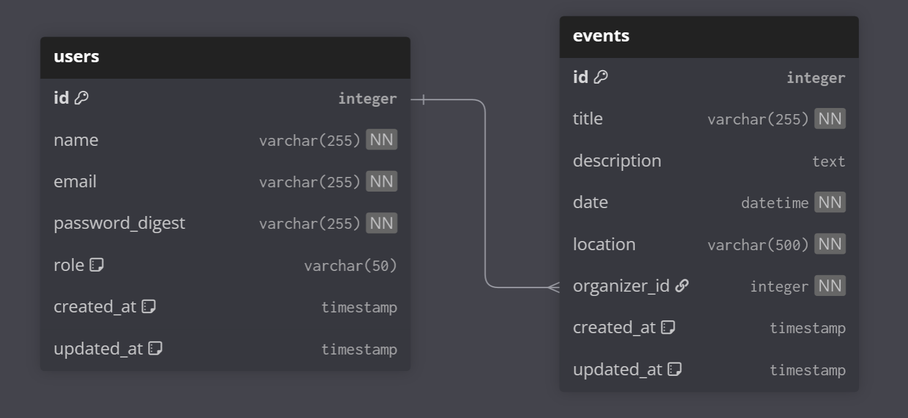

# Database Schema Draft

This document describes the initial database schema for the project.

## Entity-Relationship Diagram (ERD)

---

## Entities

### 1. User
Represents a person who can participate in or organize events.

- **id**: Primary key, unique identifier of the user.  
- **name**: User’s full name (required).  
- **email**: User’s email address (required, unique).  
- **password_digest**: Hashed password for authentication.  
- **role**: Defines user role in the system (`participant` by default, could be `organizer` or `admin`).  
- **created_at / updated_at**: Timestamps automatically managed by the system.

---

### 2. Event
Represents an event organized by a user.

- **id**: Primary key, unique identifier of the event.  
- **title**: Event title (required, unique).  
- **description**: Optional text describing the event.  
- **date**: Date and time of the event (must be in the future).  
- **location**: Event location (required).  
- **organizer_id**: Foreign key referencing `users.id`, specifies the event organizer.  
- **created_at / updated_at**: Timestamps automatically managed by the system.

---

## Relationships
- **One-to-Many**: One **User** can create many **Events**.  
- **Belongs-To**: Each **Event** belongs to exactly one **User** (the organizer).  
- **Foreign Key Constraint**: `events.organizer_id → users.id`  
  - On update: CASCADE  
  - On delete: RESTRICT
